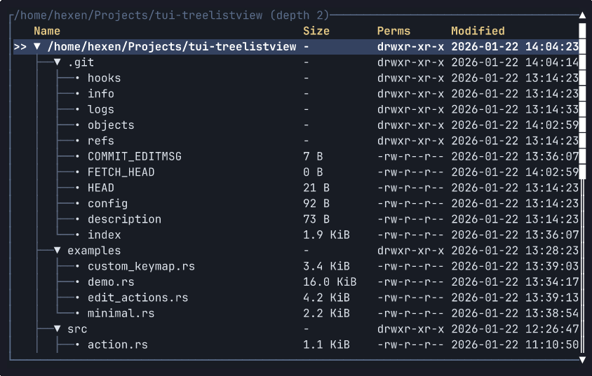

# tui-treelistview

[](https://github.com/hexqnt/tui-treelistview/actions/workflows/ci.yml)
[](https://crates.io/crates/tui-treelistview)
[](https://docs.rs/tui-treelistview)

A tree-list widget for [Ratatui](https://ratatui.rs/).

The widget focuses on interaction with tree data: browsing, navigation, filtering, sorting, marks,
and editing workflows rather than passive rendering alone.



> This widget is the open part of a closed-source project, so some features may be highly
> specialized.

## How it works

The widget is split into four layers:

- `TreeModel` provides roots, child states, and a data revision. Your application owns the data.
- `TreeQuery` describes filtering, sorting, root visibility, and selection fallback.
- `TreeListViewState` stores selection, expanded nodes, marks, scroll positions, and caches.
- `TreeListView` renders the current projection as a Ratatui table.

Typical usage:

1. Implement `TreeModel` for your data.
2. Provide a label renderer and a `TreeColumnSet`.
3. Keep `TreeListViewState` in the application state.
4. Handle actions or keys and render `TreeListView` each frame.

`TreeModel` assumes a real forest: IDs are stable and unique, nodes have one parent, cycles are not
allowed, and `revision()` changes after relevant model updates.

## Features

- Generic stable node IDs and multiple roots.
- Lazy `Unloaded` and `Loading` child states.
- Filtering, sibling sorting, and stable-ID selection.
- Dynamic columns, horizontal scrolling, and viewport row virtualization.
- Typed view/edit actions, marks, snapshots, and hit testing.
- Iterative traversal for very deep trees.

## Usage

Add the crate from crates.io:

```toml
[dependencies]
tui-treelistview = "0.2"
```

Optional features:

- `keymap` — Crossterm key bindings.
- `serde` — serialization of `TreeListViewSnapshot`.

The crate does not select a Ratatui backend. Editing types are always available.

## Examples

Most examples render into an in-memory buffer and exit immediately. The demo is interactive and
keeps edits in memory.

```bash
cargo run --example minimal
cargo run --example edit_actions
cargo run --example custom_keymap --features keymap
cargo run --example demo --features keymap -- ./ 3
```

Demo keys: arrows or `hjkl` navigate, Enter toggles, `E`/`C` expand or collapse all,
Shift+Up/Down reorder, `a` adds, `e` renames, `d` detaches, `D` deletes, `y`/`p` yank and paste,
Tab changes columns, Ctrl+Left/Right scrolls horizontally, and `q`/Esc exits.
