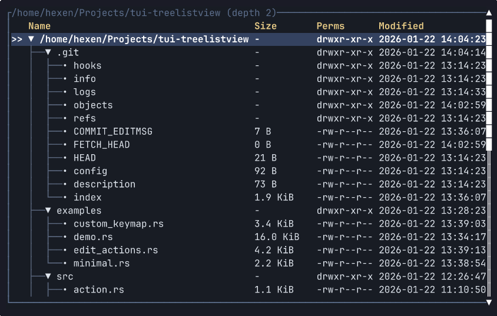

# tui-treelistview

[🇺🇸 English](./README.md) · [🇷🇺 Русский](./README.ru.md)

[](https://github.com/hexqnt/tui-treelistview/actions/workflows/ci.yml)
[](https://crates.io/crates/tui-treelistview)
[](https://docs.rs/tui-treelistview)

Виджет древовидного списка для [Ratatui](https://ratatui.rs/).

Виджет предназначен не только для отображения, но и для работы с древовидными данными: просмотра, навигации, фильтрации, сортировки, отметок и редактирования.



> Этот виджет — открытая часть проекта с закрытым исходным кодом, поэтому некоторые возможности могут быть узкоспециализированными.

## Устройство

Виджет разделён на четыре слоя:

- `TreeModel` предоставляет корневые узлы, состояния дочерних узлов и ревизию данных. Сами данные принадлежат приложению.
- `TreeQuery` описывает фильтрацию, сортировку, видимость корневых узлов и стратегию восстановления выбора.
- `TreeListViewState` хранит выбранный узел, раскрытые узлы, отметки, позиции прокрутки и кэши.
- `TreeListView` отображает текущую проекцию как таблицу Ratatui.

Типичный порядок работы:

1. Реализуйте `TreeModel` для своих данных.
2. Передайте функцию отрисовки подписей и `TreeColumnSet`.
3. Храните `TreeListViewState` в состоянии приложения.
4. Обрабатывайте действия или нажатия клавиш и отрисовывайте `TreeListView` в каждом кадре.

`TreeModel` поддерживает деревья с корневым узлом, леса и ациклические графы. Идентификаторы должны быть стабильными, общие дочерние узлы отображаются как отдельные вхождения строк, списки корневых и соседних узлов не должны содержать повторяющихся идентификаторов, циклы запрещены, а значение `revision()` должно меняться после значимых обновлений модели.

## Возможности

- Обобщённые стабильные идентификаторы узлов, несколько корней и навигация по ориентированному ациклическому графу с учётом вхождений.
- Состояния дочерних узлов `Unloaded` и `Loading` для отложенной загрузки.
- Фильтрация, сортировка соседних узлов и выбор по стабильному идентификатору.
- Динамические столбцы, горизонтальная прокрутка и виртуализация строк области просмотра.
- Типизированные действия просмотра и редактирования, отметки, снимки состояния и определение элемента по координатам.
- Итеративный обход очень глубоких деревьев.

## Подключение

Добавьте крейт с crates.io:

```toml
[dependencies]
tui-treelistview = "0.2"
```

Необязательные возможности:

- `keymap` — привязки клавиш Crossterm.
- `serde` — сериализация `TreeListViewSnapshot`.

Крейт не выбирает бэкенд Ratatui. Типы для редактирования доступны всегда.

## Примеры

Большинство примеров выполняют отрисовку в буфер в памяти и сразу завершаются. Демонстрационное приложение интерактивно и хранит изменения в памяти.

```bash
cargo run --example minimal
cargo run --example edit_actions
cargo run --example custom_keymap --features keymap
cargo run --example demo --features keymap -- ./ 3
```

Управление демонстрационным приложением: стрелки или `hjkl` — навигация, Enter — переключение состояния узла, `E`/`C` — раскрытие или сворачивание всех узлов, Shift+Up/Down — изменение порядка, `a` — добавление, `e` — переименование, `d` — отсоединение, `D` — удаление, `y`/`p` — копирование и вставка, Tab — смена столбцов, Ctrl+Left/Right — горизонтальная прокрутка, `q`/Esc — выход.

## Бенчмарки

Бенчмарки Criterion охватывают построение проекции, фильтрацию, сортировку, операции с состоянием, проверку модели и отрисовку деревьев разных форм и размеров.

```bash
cargo bench --bench perf
cargo bench --bench perf -- --test
cargo bench --bench perf -- projection/rebuild
```

В режиме `--test` каждый сценарий выполняется один раз, что удобно для быстрой проверки бенчмарков.
