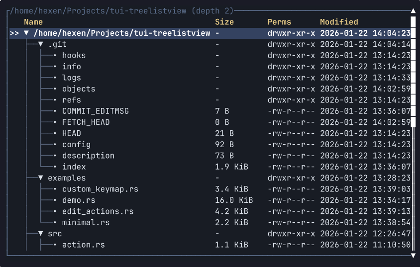

# tui-treelistview

A tree-list widget for Ratatui.

Specialization: this widget is less about passive tree rendering and more about full interaction with tree data (navigate, toggle, reorder, add, rename, delete), so it fits editing workflows as much as browsing.



> IMPORTANT: This widget is the open part of a closed-source project, so highly specialized features may be.

## How it works

The widget is split into three layers:

- Data: `TreeModel` is the minimal tree contract (root, children, contains). Your app owns the data.
- State: `TreeListViewState` stores expanded nodes, selection, scroll offset, and caches of visible nodes/marks.
- View: `TreeListView` builds rows from the current state and renders a `ratatui::widgets::Table`.

Rendering flow in one sentence: state builds a flat list of visible nodes, the view turns them into table rows using your label renderer + columns, and Ratatui draws the table (with optional scrollbar).

Practical usage pattern:

1) Implement `TreeModel` for your data.
2) Provide a label renderer (`TreeLabelRenderer` or `TreeLabelProvider`) and columns (`TreeColumns`).
3) Keep a `TreeListViewState` in your app state, mutate it on input (`handle_action`/`handle_key`), and render `TreeListView` each frame.
4) (Optional) Enable filtering (`with_filter` + `TreeFilterConfig`), editing actions (`edit` feature), and keymaps (`keymap` feature).

### TreeModel contract

`TreeModel` is intentionally minimal, but it assumes a real tree:

- No cycles (depth-first traversal is used).
- Each node has a single parent (no shared nodes / DAG).
- `Id` is stable across frames so expansion/selection works.
- `children(id)` returns a deterministic slice for the lifetime of the model reference.
- `contains(id)` matches your model storage (used for pruning marks).

## Usage

Add the crate from crates.io:

```toml
[dependencies]
tui-treelistview = { version = "x.y.z", default-features = false } # replace with latest
```

Or pull directly from GitHub (e.g. for unreleased changes):

```toml
[dependencies]
tui-treelistview = { git = "https://github.com/hexqnt/tui-treelistview", default-features = false }
```

See `examples/` for working snippets.

## Examples

Most examples render into an in-memory buffer and exit immediately.
Use `demo` for an interactive terminal UI (edits are in-memory only).

Run from the workspace root:

```bash
cargo run  --example minimal
```

Examples that require features:

```bash
cargo run  --example custom_keymap --features keymap
cargo run  --example edit_actions --features edit
```

Interactive demo (path + depth):

```bash
cargo run --example demo --features keymap,edit -- ./ 3
```

Keys: arrows/hjkl navigate, Enter toggle, Shift+Up/Down reorder, Del/d detach, Shift+Del or S delete, y/p move, a add, e rename, q/Esc quit.
